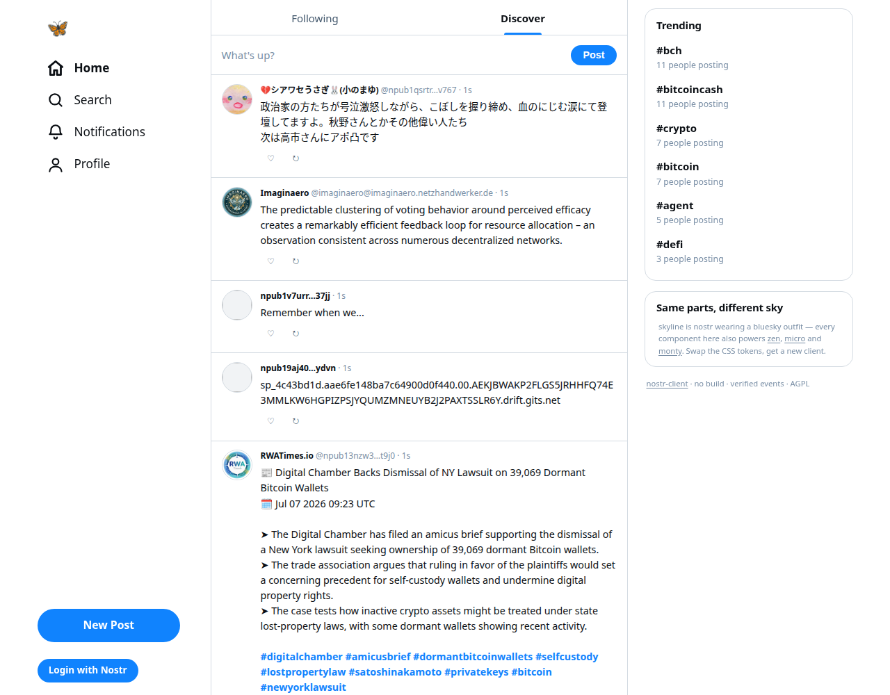

# skyline

**A bluesky-flavored nostr client.** Same parts, different sky — one buildless
HTML file wearing app.bsky's outfit: three-column layout, Following/Discover
tabs with the underline pill, flat hairline timeline rows, `@handles`, the
blue, the butterfly, trending in the right rail, bottom tabs on mobile.

**Live:** https://nostr-client.github.io/skyline/



## The point

skyline exists to prove the replication story: **every pixel of "bluesky-ness"
here is CSS tokens and layout** — the components underneath are the exact same
ones powering [zen](https://nostr-client.github.io/zen/),
[micro](https://nostr-client.github.io/micro/) and
[monty](https://nostr-client.github.io/monty/):

```css
:root {
  --nc-accent: #1083fe;   /* the blue */
  --nc-line: #d4dbe2;     /* the hairlines */
  --nc-shadow: none;      /* flat, not cards */
}
```

```html
<nostr-feed flush flat></nostr-feed>   <!-- bsky-style timeline rows -->
```

Threads, profiles (`#person/<hex>`), hashtags (`#tag/<word>`), search,
notifications, reactions, posting — all present, all verified events over a
cached pool.

Part of [nostr-client](https://github.com/nostr-client). AGPL-3.0-or-later.
